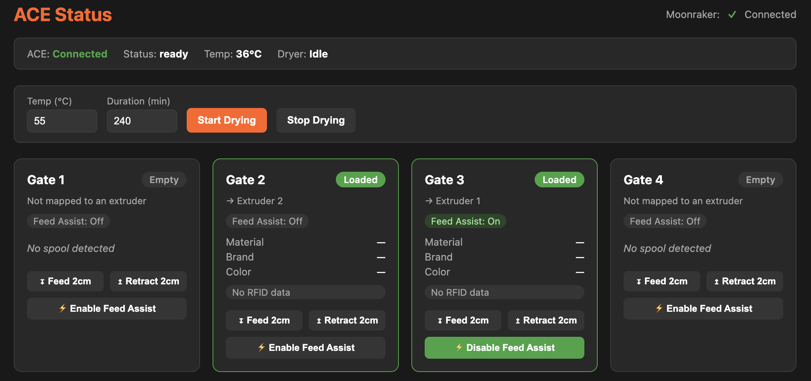

<h1 align="center">SnapACE</h1>
<p align="center">
  <a aria-label="License" href="https://github.com/BlackFrogKok/SnapAce/blob/main/LICENSE">
    
  </a>
  <a aria-label="Last commit" href="https://github.com/BlackFrogKok/SnapAce/commits/">
    
  </a>
  <a aria-label="Tests" href="https://github.com/andreasscheck/SnapAce/actions/workflows/tests.yml">
    
  </a>
  
</p>
<p align="center">
Integration of the Anycubic ACE Pro with the Snapmaker U1 printer as external filament storage.
</p>

## Contents

- [Features](#features)
- [Pinout and Wiring](#pinout-and-wiring)
- [Installation](#installation)
  - [Map extruders to ACE gates](#map-extruders-to-ace-gates)
  - [Alternative: bake SnapAce into a firmware image](#alternative-bake-snapace-into-a-firmware-image)
  - [Faster iteration: push straight to a running printer](#faster-iteration-push-straight-to-a-running-printer)
- [Status UI (`/ace`)](#status-ui-ace)
- [Tool count cleanup](#tool-count-cleanup-baked-in-build-only)
- [Repository Structure](#repository-structure)
- [Development](#development)
- [Support](#support)

## Features

- Feeds and retracts filament from the ACE Pro's 4 gates on extruder
  switch, with per-gate feed assist kept in sync with whichever extruder is
  actually printing.
- Reads RFID tag data (material, brand, color) off each gate and applies it
  to the printer's filament config.
- Drives the ACE Pro's built-in dryer.
- A status/control web UI at `/ace` — gate state, RFID data, feed
  assist, manual jog, and dryer controls, live over Moonraker's existing
  WebSocket API (see [Status UI](#status-ui-ace)).
- Removes 28 dead tool-change buttons (`T4`-`T31`) that stock firmware
  shows for extruders the U1 doesn't have (baked-in build only, see
  [Tool count cleanup](#tool-count-cleanup-baked-in-build-only)).

## Pinout and Wiring
**You will need to make a cable to connect the ACE to a USB**


## Installation

1.  **Custom Firmware:** Install the latest [Paxx12](https://github.com/paxx12-snapmaker-u1/SnapmakerU1-Extended-Firmware) custom firmware to gain SSH access to your Snapmaker U1.
2.  **Enable Debug Mode:**
    *   Connect to your printer via SSH.
    *   Execute the following command to enable debug mode:
        ```bash
        touch /oem/.debug
        ```
> [!NOTE]
> This mode allows user files to persist after a reboot.
> [!WARNING]
> Enabling debug mode will reset your Wi-Fi settings. You will need to reconnect to your Wi-Fi network after the printer reboots.
3.  **Install Extra Modules:**
    *   Copy [klipper/extras/ace.py](klipper/extras/ace.py) and
        [klipper/extras/filament_feed.py](klipper/extras/filament_feed.py)
        from this repository to `/home/lava/klipper/klippy/extras/` on your printer.
> [!IMPORTANT]
> Rename the stock `filament_feed.py` to `filament_feed_stock.py` before copying the new one.
4.  **Install Kinematics Module:**
    *   Copy [klipper/kinematics/extruder.py](klipper/kinematics/extruder.py)
        from this repository to `/home/lava/klipper/klippy/kinematics/`.
> [!IMPORTANT]
> Rename the stock `extruder.py` to `extruder_stock.py` before copying the new one.
5.  **Configure Klipper:**
    *   Copy [ace.cfg](ace.cfg) to the custom config directory: `/config/extended/klipper/`.
6.  **Calibrate Feeding Length:**
    *   Connect all four PTFE tubes between the ACE Pro gates and the U1.
    *   Measure the approximate length of the PTFE line.
    *   Subtract approximately 5cm from this measurement.
    *   Open `ace.cfg` and find the `feed_length:` variable.
    *   Enter your calculated value (e.g., if the line is 80cm, set `feed_length: 750`).
    *   *Goal:* The filament should stop approximately 5cm away from the toolhead after being fed from the ACE Pro gate.
7.  **Restart:** Restart your printer to apply the changes.

> [!NOTE]
> The [`v1.5.2-paxx12-21`](https://github.com/paxx12-snapmaker-u1/SnapmakerU1-Extended-Firmware/releases/tag/v1.5.2-paxx12-21) release notes warn that SSH-installed extensions like this one have been reported to cause `Klipper failed to start` or bootloops. Keep a `full-recover.txt` file on a FAT32 USB stick as a recovery path (see the firmware project's docs), or use the baked-in build below to at least rule out file-copy mistakes.

### Map extruders to ACE gates

By default, every extruder uses the ACE gate with the same index. The mapping
can be changed in `ace.cfg`:

```ini
[ace]
extruder_gate_map: 0=2, 2=0
```

In this example, extruder 0 uses ACE gate 2 and extruder 2 uses ACE gate 0.
Extruders 1 and 3 are not listed and therefore use the built-in feeder. Use
`extruder_gate_map: none` to disable automatic ACE feeding for every extruder.

### Alternative: bake SnapAce into a firmware image

Instead of copying files over SSH, [scripts/build_custom_firmware.sh](scripts/build_custom_firmware.sh)
builds a full custom firmware `.bin` with these changes included, using the
[SnapmakerU1-Extended-Firmware](https://github.com/paxx12-snapmaker-u1/SnapmakerU1-Extended-Firmware)
project's own overlay/mod build system (Docker required):

```bash
scripts/build_custom_firmware.sh v1.5.2-paxx12-21
```

This clones the firmware repo (as a sibling directory by default), extracts
the matching stock firmware, 3-way merges this repo's
[klipper/](klipper/) files onto the *current* stock files (so upstream
fixes made after `original/` was captured aren't silently dropped), and
produces `firmware/U1_extended-andreasscheck.bin` in the firmware repo. Flash
it the same way as any other release build (`Settings` > `About` > `Firmware
Version` > `Local Update`).

If stock `filament_feed.py`/`extruder.py` have moved since `original/` was
last captured, the merge may hit a conflict — the script stops and points at
the file to resolve by hand; see
`overlays/mods/andreasscheck/10-snapace/README.md` in the firmware repo for
how to regenerate the overlay's patches afterwards.

### Faster iteration: push straight to a running printer

For quick edit/test cycles, skip both the firmware build and the manual SSH
copy above — [scripts/deploy_to_printer.sh](scripts/deploy_to_printer.sh)
copies everything under [klipper/](klipper/) and [ace-ui/](ace-ui/) straight
to a printer that already has SSH enabled (see the firmware project's
[SSH Access docs](https://github.com/paxx12-snapmaker-u1/SnapmakerU1-Extended-Firmware/blob/develop/docs/ssh_access.md)),
then restarts the affected services:

```bash
scripts/deploy_to_printer.sh 192.168.1.100
```

Requires `sshpass` (`brew install hudochenkov/sshpass/sshpass`). Note it
does a full `/etc/init.d/S60klipper restart`, not `FIRMWARE_RESTART` — the
latter reuses the already-running Python process and won't pick up changed
`.py` files, since the interpreter never re-imports them from disk.

## Status UI (`/ace`)

A status and control page for the ACE Pro, served at
`http://<printer-ip>/ace/` (also linked from the firmware-config settings
menu as **ACE Status**). It's a thin client over Moonraker's existing
WebSocket API, not a new backend:
[klipper/extras/ace.py](klipper/extras/ace.py)'s `get_status()` exposes the
real serial connection state, per-gate `slots` (raw RFID/filament read) and
`gate_extruder` mapping alongside `gate_status`, and [ace-ui/](ace-ui/) is a
static page that renders and acts on them.



- **Connection status** — the ACE's actual USB/serial link (distinct from
  the Moonraker WebSocket link shown next to it, which stays up even if the
  ACE itself is unplugged or powered off), with a banner when disconnected.
- **Dryer controls** — start/stop the ACE's dryer with a configurable
  temperature and duration.
- **Per gate**: whether a spool is loaded, which extruder (if any) it
  feeds, the filament read off its RFID tag (material, brand, color), feed
  assist status (on/off/switching), and buttons to feed/retract 2cm or
  enable feed assist for that gate.

Install:

- **Baked-in build:** included automatically by
  [scripts/build_custom_firmware.sh](scripts/build_custom_firmware.sh) (see
  above) — nothing extra to do.
- **Manual SSH install:** in addition to step 3 above (needed for the
  `get_status()` fields the page reads), copy `ace-ui/html/*` to
  `/usr/local/ace-ui/html/` and `ace-ui/nginx/ace.conf` to
  `/etc/nginx/fluidd.d/ace.conf` on the printer, then restart nginx
  (`/etc/init.d/S50nginx restart`) to pick up the new config. Optionally
  also copy `ace-ui/firmware-config/12_links_ace_status.yaml` to
  `/usr/local/share/firmware-config/functions/` to add the menu link.

## Tool count cleanup (baked-in build only)

Stock `fluidd.cfg` defines `[gcode_macro T4]` through `[gcode_macro T31]` —
28 stub tool-change macros that just call `SWITCH_OF_EXTENDED_EXTRUDER`.
`T0`-`T3` aren't macros there at all; Klipper registers those natively from
the 4 real `[extruder]`/`[extruderN]` sections. The U1 only has 4 physical
extruders, so Fluidd's Tools panel ends up showing 28 dead buttons
alongside the 4 real ones.

[scripts/build_custom_firmware.sh](scripts/build_custom_firmware.sh) removes
those 28 stubs automatically, via
[scripts/remove_unused_tool_macros.py](scripts/remove_unused_tool_macros.py)
(no manual SSH steps — this one's baked-in only, since it patches a stock
firmware file rather than shipping new ones).

> [!NOTE]
> This only takes effect on boot through Snapmaker's own
> `origin_printer_data` → `/oem/printer_data` config sync
> (`etc/init.d/S48setup-lava-env`), and that sync is skipped entirely if
> `/oem/printer_data/.fluidd` or `/oem/.factory` already exists on the
> printer (i.e. an already-set-up printer). Delete that marker before
> flashing to force the sync, or copy the patched `fluidd.cfg` to
> `/oem/printer_data/config/fluidd.cfg` by hand over SSH and restart Klipper.

> [!WARNING]
> If you have AFC hardware wired through lanes above index 3, skip this —
> it removes the tool slots you'd need.

## Repository Structure

```text
.
├── klipper/                 Klipper payload, mirrors the on-printer layout
│   ├── extras/
│   │   ├── ace.py               ACE Pro serial driver (new Klipper extra)
│   │   └── filament_feed.py     Stock load/unload state machine, ACE-patched
│   └── kinematics/
│       └── extruder.py          Stock extruder switching, ACE-patched
├── original/                 Pre-patch stock baselines (for 3-way merges)
│   ├── extras/filament_feed.py
│   └── kinematics/extruder.py
├── ace-ui/                   The /ace status UI
│   ├── html/                    index.html / script.js / style.css
│   ├── nginx/ace.conf           Serves /ace/ from html/
│   └── firmware-config/         Settings-menu link definition
├── scripts/
│   ├── build_custom_firmware.sh Bakes klipper/ + ace-ui/ into a firmware .bin
│   ├── deploy_to_printer.sh     Pushes klipper/ + ace-ui/ over SSH for fast iteration
│   └── remove_unused_tool_macros.py
├── tests/                    Unit tests (see Development below)
└── ace.cfg                   Klipper config template for this integration
```

## Development

Run the test suite (no real Klipper install needed — `ace.py` is tested
directly, `filament_feed.py`/`extruder.py` are import-smoke-tested against
minimal stubs for the Klipper/Snapmaker internals they depend on, since
Snapmaker's own state machines in those files aren't practical to drive
outside a real printer):

```bash
python3 -m unittest discover -s tests -v
```

CI runs this on every push and pull request (see
[.github/workflows/tests.yml](.github/workflows/tests.yml)).

For iterating against a real printer instead of guessing, see
[Faster iteration](#faster-iteration-push-straight-to-a-running-printer) above.